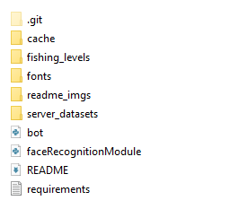

# Discord Mega Bot
A discord bot with many AI features, image and video editor, news webscraper, procedural 2D fishing game, server economy, investing analysis and forecasting tools, mock hold and short positions, server NLP analysis, image restoration, Steam API for current sales and game recommendation, Spotify API for artist and song recommendation, downloading, music streaming, dj (akin to spotify dj) and more.

Most of the AI commands are through the replicate or openai API. Running a lot of these solutions locally is too heavy for a lot of consumer machines let alone free/cheap cloud computing machines. Lightweight solutions are ran locally.

The [**news API**](https://newsapi.org/) is free, [**Replicate API**](https://replicate.com/) is started for free, [**openai API**](https://openai.com/blog/openai-api) is pay as you go

The [**Steam API**](https://steamcommunity.com/dev) is free, [**Spotify API**](https://developer.spotify.com/documentation/web-api) is free with an account

# Getting Started
* Once you've cloned the repo you can ****pip install -r requirements.txt****
* Download any fonts you want for video editing and place them in the fonts folder. It uses [Impact](https://www.dafontfree.io/download/impact/) by default and loads Arial if that fails. **fonts must be .ttf**
* Get your [bot token](https://www.writebots.com/discord-bot-token/) from Discord developer portal.
* Get your API keys (linked above).
* Open bot.py and plug keys into the variables at the top of the script.
* There's also many things you can customize (heavily commented, you'll figure it out).

Your directory should look like this:

### **NOTE:**

A lot of the AIs on replicate indicate they are for research purposes only and **'can't be used financially'**. Keep this in mind if you use this bot / strip parts of it and try sell it.

Speaking to the bot in voice chat currently always uses the **microphone on the host machine!!!** I was unable to find a way for the client to listen to calls so I made that a bandaid fix. That means if you're **running this on a hosting service it won't be able to hear you and if you're running it on your machine it will be listening to your mic** when /talk or /speak_when_spoken_to is called.

(This is an admin only command by default)

Transcribed audio from your mic is sent to ChatGPT then the response is converted to audio via tts and played.

# New
* Slash commands!
* Alpaca is removed. We didn't use it much and am preparing for a cloud deployment
* Procedurally generated fishing game!
    * Maps/lakes have 9 tiles with procedurally generated attributes (bite chance, available fish)
    * Users can call `/generate_secret_spot` to create their own fishing spot only they can fish at
    * A server lake/map is created that everyone starts on
    * type `/cast` the click the ! emoji quickly to hook the fish, fight the fish and reel it in when you can through the reaction UI
    * call `/move_tile` to move to another spot on the lake
    * I'll expand this adding more fish to catch, deeper procedural generation, and unlockables but for now this is good
* Assets!
    * Users can analyze, forecast, and fake buy and sell stocks and crypto
    * `/buy` or `/buy_short` to buy shares or short positions
    * `/forecast_asset` to prophet forecast. `/forecast_asset_test` to prophet forecast (train and test)
    * `/asset_rundown` to get Yahoo data on an asset. Click the brain emoji to get an AI summary and insight into the data!
* Similiar songs and artists (Spotify API)
* Face cropping (good in tangent with some new AI commands like `/edit_face`)
* More restoration commands (coloring, sharpening, alternate face restoring)
* NLP analysis
    * /analyze @user sends a report of the users activity, favourite topics, average sentiment, etc
    * /sentiment `topic` sends a short rundown of the servers sentiment towards the given topic
* Financially and time optimized API requests
* More AI commands
* More I'm forgetting

# Coming Soon
* Make a new /help (hopefully slash commands provide enough info for now)
* More games / develop fishing game deeper
* Make code nicer etc

# Examples For Some of My Favourite Features

A screenshot of the main fishing minigame:

When the button is green you can move, reel the fish in without letting it go off the screen, if it gets angry, hit the 'zzz' button or the line will snap.

Input:

    /get_sales

Output:

Input:

Output:

Input:

    /asset_rundown AMZN

Output:

If we click the little brain emoji reaction we get an AI summary:

Input:

/sharpen

/color

/restore

Output:

Input:

    /download_chat 10
    /sentiment TEST_TOPIC

Output:

Input:

    /doodle <link_to_doodle.png> "A windmill in a green meadow"

Output:

Input:

    /interp <link_to_doodle.png> <link_to_windmill.png> 5

Output:

Input:

    /gen_video "a man eating cereal"

Output:

(I converted it to a gif for the readme, it outputs an mp4 by default.)