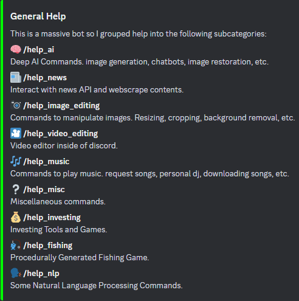

# Discord Mega Bot
A discord bot with many AI features, image and video editor, news webscraper, music streaming, downloading, and dj (akin to spotify dj) and more.

# New
* More video editing subcommands,
* More Image editing commands,
* Audio manipulation (right now just distortion and reverb),
* Customizable server currency,
* Trivia Game, coin flip, 'monster chase' game,
* Procedurally generated fishing game with turn based 2D emoji UI!
    * Visual lake maps are simply procedurally generated for variation,
    * Lake maps are split into 9 tiles each with their own attributes (what fish are in those tiles, how often they bite),
    * Fishing stats are saved, size weight and price of fish range,
    * Some fish are rarer and more expensive than others,
    * Rarity applies to spawning in a tile and being the fish you hooked,
    * Each user can create their own secret fishing spot.
* More image restoration (old photo sharpening, coloring, and another face restoration),
* max dim checks on image api requests to save time and money,
* command to check the current song the dj is playing,
* command to see similiar songs or artists to a given song or artist (spotify API),
* Check Steam game sales,
* Unsure what game to play? have 3 from your library recommended,
* A few smaller things.

Most of the AI commands are through the replicate or openai API. Running a lot of these solutions locally is too heavy for a lot of consumer machines let alone free/cheap cloud computing machines. Lightweight solutions are ran locally. However [due to the nature of the project,](https://github.com/antimatter15/alpaca.cpp) the **alpaca LLM is also ran locally.** It uses ~4.5gb of ram and takes my CPU to ~30% usage. Keep this in mind if picking a cloud hosting service and you may have to exclude it and use Chatgpt instead. Alpaca is also slower than an API request to chatGPT, on my machine at least, and currently less flexible in terms of personality. A 19 word prompt generated 144 words in one minute and four seconds. Not awful and it's free.

The [**news API**](https://newsapi.org/) is free, [**Replicate API**](https://replicate.com/) is started for free, [**openai API**](https://openai.com/blog/openai-api) is pay as you go

# Getting Started
* Once you've cloned the repo you can ****pip install -r requirements.txt****
* If using Alpaca:
    * [Download latest Alpaca release](https://github.com/antimatter15/alpaca.cpp/releases/tag/81bd894) and extract so chat.exe is beside bot.py
    * [Download .bin](https://huggingface.co/Sosaka/Alpaca-native-4bit-ggml/blob/main/ggml-alpaca-7b-q4.bin) and move to same location. (4.2GB)
* Download any fonts you want for video editing and place them in the fonts folder. It uses [Impact](https://www.dafontfree.io/download/impact/) by default and loads Arial if that fails. **fonts must be .ttf**
* Get your [bot token](https://www.writebots.com/discord-bot-token/) from Discord developer portal.
* Get your API keys (linked above).
* Open bot.py and plug keys into the variables at the top of the script.
* There's also many things you can customize (heavily commented, you'll figure it out).

Your directory should look like this:

### **NOTE:**

A lot of the AIs on replicate indicate they are for research purposes only and **'can't be used financially'**. Keep this in mind if you use this bot / strip parts of it and try sell it.

Speaking to the bot in voice chat currently always uses the **microphone on the host machine.** I was unable to find a way for the client to listen to calls so I made that a bandaid fix. That means if you're **running this on a hosting service it won't be able to hear you and if you're running it on your machine it will be listening to your mic** when /talk or /speak_when_spoken_to is called.

(This is an admin only command by default)

Transcribed audio from your mic is sent to ChatGPT (or alpaca if you don't mind waiting) then the response is converted to audio via tts and played.

# Coming Soon
* Update help!
* upgrade [Alpaca](https://github.com/antimatter15/alpaca.cpp) to [LLaMA](https://github.com/ggerganov/llama.cpp)
* More games / develop fishing game deeper,
* Slash commands / cogs, make code nicer...
* Async API requests,
* Lite version,
* Discover music through dj,
* NLP project of some sort,
* More...

# Examples For Some of My Favourite Features

Input:

    /doodle <link_to_doodle.png> "A windmill in a grenn meadow"

Output:

Input:

    /interp <link_to_doodle.png> <link_to_windmill.png> 5

Output:

Input:

    /gen_video "a man eating cereal"

Output:

(I converted it to a gif for the readme, it outputs an mp4 by default.)

# All Commands (MISSING NEWEST COMMANDS)

## <u>**AI Commands**</u>
**restore**

    Image Restoration
    /restore <link_to_old_image> = restored image

**gen_video**
  
    Text to Video
    /gen_video "a panda eating bamboo" = video of panda eating bamboo

**edit_face**

    Manipulate a headshot
    /edit_face <link_to_face> "a face with a bowl cut" = the given face with a bowl cut

**age_face**

    Simulate someones face at a given age or make a gif of them aging
    /age_photo <link_to_face> 80 = the given face at age 80 (only send the link to make a gif)

**doodle**
 
    Provide a doodle and a prompt to generate an image
    /doodle <link_to_img> "a photo of an orange cat" = Photo of orange cat mapped to doodle

**explain**

    Ask questions about an image
    /explain <link_to_img_of_CN_tower> "Where is this photo" = "This photo was taken in Toronto"

**interp**

    Interp between two images
    /interp <link_to_img1> <link_to_img2> = interp animation

**style_transfer**

    Transfer the style of one image onto another.
    /style_transfer <link_to_content_img> <link_to_style_img> = sends new image with new style

**talk**

    Talk to the bot in voice chat.
    /talk = make the bot join the call (speak_when_spoken_to = False!).
    say "goodbye" to make the bot leave and wipe memory.
    
    NOTE: This currently uses the microphone on the host Machine!!!

**speak_when_spoken_to**

    Talk to the bot in voice chat.
    /talk = make the bot join the call (speak_when_spoken_to = True!).
    say "goodbye" to make the bot leave and wipe memory.

    NOTE: This currently uses the microphone on the host Machine!!!

**chat**

    Talk to the bot in text chat.
    /chat "hey <bot_name> how are you?" = it will send a text response. Type "bye" in message to wipe memory.

**alpaca**

    Chat with Alpaca LLM
    /alpaca how are you doing today? = will tell you how it is doing

**adventure**

    Start a dnd adventure (expiremental WIP).
    /adventure I am a monk, where am I = dungeon master dnd response.

**wipe_memory**

    Wipes chatbot memory

**gen_image**

    Generate Image with Openai.
    /gen_image a siamese cat = generates and posts a 1024x1024 image of a white cat.

**sd**

    Stable diffusion image generation
    /sd "A cow jumping over the moon" = image of a cow jumping over the moon

**var_image**

    Make a variation of an image with Openai.
    /var_image <link_to_image> = generates and posts a 1024x1024 variation of linked image.

## <u>**News Commands**</u>

**/news**

    Retrieves and embeds the latest top 3 most popular articles.

**/news explain x y**

    Where x is a number from 1 to 3. This will webscrape the url and print the contents of the article.
    Where y is a number from 1-inf representing how many discord paragraphs the bot can return. Leave empty for full article.

**/news more**

    Shows more articles continuing to sort by popularity.

**/news <topic>**

    Retrieves and embeds the latest top 3 most popular articles about a given topic.

## **<u>Video Editing Commands</u>**

/editor has a lot of commands, here they are:

**/editor load <link>**

    Loads the video you will be working with.

**/editor save**

    Saves the output video as the working video.
    This way you don't have to reload the original video over and over if you mess up.

**/editor stats**

    Send stats of the video, bit rate, size, length, and resolution.

**/editor fx <method> <factor>**

    A couple ways to manipulate the video.(more being added)

**/editor fx speed 5** 

    multiplies video speed by 5.

**/editor fx loop 5**

    loops the video for 5 seconds.

**/editor fx loop None 5**

    loops the video 5 times.

**/editor top_text "text" size color font**

    Adds top text to video (default is Impact) Font is automatically fit to video width and wrapped.

**/editor top_text "hello world" 50 red impact.ttf**

    adds red impact size 50 font to the top of the video.
    Size,color,and font parameter can be left blank, those are the default values.
    To use other fonts they must be downloaded and placed in the bots working directory.

**/editor bottom_text "text" size color font**

    Same thing but bottom text.

**/editor compress method arg1 arg2**

    Means for compressing videos.

****/editor compress b****  

    compression via bitrate reduction.

    Leaving arg 1 blank will aim for a target size of ~25mb. 

****/editor compress b 8**** 

    will aim for 8 mb.

****/editor compress r**** 

    Lower the resolution. By default it halves it but can be specified through arg 1 and 2.

**/editor compress r 0.33**

    will make a resolution one third the original.

**/editor compress r**

    1920 1080 resizes to 1920x1080

**/editor replace_audio link priority**

    Replaces audio of working video with audio from video you link to.

    Leave empty to remove audio.

    The priority argument can be passed as a or v

    v will make the duration fit the video, a will make the duration fit the audio. Default is a.

**❗ NOTE:**

    Codec is h.264 with medium preset and a crf of 23. Discord doesn't support 265 and vp9 and av1 are too slow.
    More fx will be added. 
    Extreme speeding of the video can occasionally corrupt audio and may prevent you from doing other tasks. Remove the 
    audio using audio_replace to modify further.
    Discord bots have a max upload of 25mb. If you can not compress it further, ask if an admin can fish it out of the working directory.
    Can't watch the video on Mobile or in media player? Use `/editor stats` to make sure the resolution doesn't contain odd numbers.

## **<u> Music Commands </u>**

**play**

    Stream a given youtube video to the voice channel (admin only // must be youtube or music.youtube link).
    /play <link_to_video> = joins voice channel, streams video, disconnects.
**skip**

    Stop the stream of a youtube video to the voice channel.
    /skip = skips/ends song

**stop_music**

    Stop the dj or music player and make it leave the call.
    /stop_music = stop stream and end call.

**dj**

    Start the dj/radio station in the current voice channel.
    /dj = dj ai joins the call and plays songs from music channel.

**scrape_music**

    Build a dataset of youtube links of music to stream (saved as csv)
    /scrape_music 1000 = scrapes 1000 messages for links in music channel.

**recommend**

    Recommend a song to the dj

## **<u> Misc Commands </u>**

**rand**

    Send a random image from a channel.
    /rand = sends random image from channel

**rand_image**

    Send a random image from main channel.
    /rand = sends random image from main channel

**rand_chat**

    Send a random chat from main channel.
    /rand = sends random chat from main channel

## **<u>Image Editing Commands</u>**
**remove_bg**

    Remove the background of a given image (translucent png).
    /remove_bg <link_to_image> = sends new image
**new_bg**

    replace the background of a given image with another image.
    /new_bg <link_to_img_foreground> <link_to_img_new_background> = sends new image with new background
